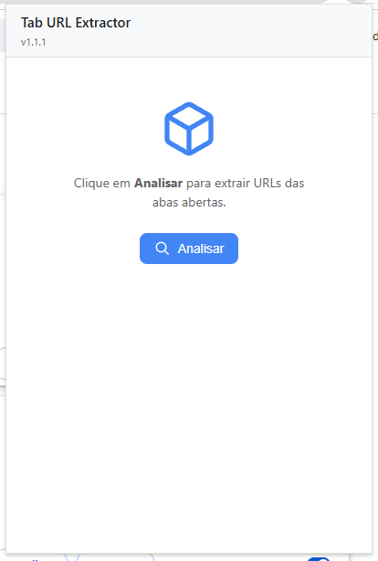
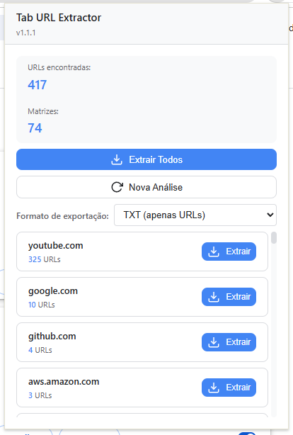
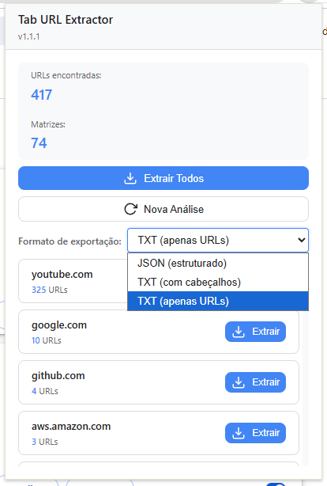

 # Tab URL Extractor

<p align="center">
  
</p>

<p align="center">
  <a href="#instala%C3%A7%C3%A3o"></a>
  <a href="#licen%C3%A7a"></a>
  
  
</p>

Extensão Chrome (Manifest V3) para **extrair URLs das abas abertas**, aplicar **normalização + deduplicação**, **agrupar por domínio (URL-Matriz)** e **exportar** em formatos prontos para automação.

## O que faz

- Faz scan das abas abertas e coleta URLs via Chrome Tabs API.
- Normaliza URLs (remove `#...`, remove `utm_*` e outros tracking params, ordena query params).
- Deduplica por URL normalizada.
- Agrupa por domínio em **URL-Matrizes** (com contagem por grupo).
- Exporta em `json`, `txt` e `txt-simple`.
- Faz download local via `chrome.downloads` (sem backend, sem nuvem).

## Instalação

1. Abra `chrome://extensions`
2. Ative **Modo do desenvolvedor**
3. Clique em **Carregar sem compactação**
4. Selecione a pasta do projeto

Guia completo: [docs/INSTALLATION.md](docs/INSTALLATION.md)

## Screenshots

<p align="center">
  
  
</p>

<p align="center">
  
</p>

Documentação consolidada (HTML): [docs/TUE-Documentation-v1.html](docs/TUE-Documentation-v1.html)

## Estrutura (resumo)

- `core/`: processamento (normalização, dedup, matrizes, export)
- `infrastructure/`: integração com APIs do Chrome (tabs, downloads)
- `background/`: Service Worker (orquestração + estado temporário)
- `popup/`: UI do popup
- `utils/`: constantes, logger, validadores
- `types/`: tipos via JSDoc

Para detalhes de arquitetura e fluxos: veja [docs/ARCHITECTURE.md](docs/ARCHITECTURE.md).

### Trocar a fonte de abas (exemplo)

```javascript
// Exemplo: substituir infrastructure/tab-collector.js por outra fonte
import { TabCollector } from './infrastructure/tab-collector.js';

export async function collectRawTabs() {
  return await TabCollector.collectAllTabs();
}
```

## 🧪 Testabilidade

O `core/` é agnóstico de Chrome APIs e pode ser testado isoladamente:

```javascript
import { UrlProcessor } from './core/url-processor.js';

// Normaliza (remove fragment + tracking params)
const url = 'https://www.youtube.com/watch?v=abc&utm_source=test#section';
const normalized = UrlProcessor.normalizeUrl(url);

console.log(normalized);
// https://youtube.com/watch?v=abc
```

## 📝 Convenções de Código

- **Módulos ES6**: `import`/`export`
- **Async/Await**: para operações assíncronas
- **JSDoc**: documentação de funções e tipos (`types/index.js`)
- **Naming**:
  - Arquivos: kebab-case (`url-processor.js`)
  - Funções: camelCase (`normalizeUrl()`)
  - Constantes: UPPER_SNAKE_CASE (`CONSTANTS`)

## 🛡️ Segurança

- ❌ Sem rede/terceiros: processamento e export são locais.
- ✅ Ações explícitas do usuário (analisar/exportar pelo popup).
- ✅ Validação e tratamento de erros no core (`utils/validators.js`).
- ✅ Estado temporário em memória no Service Worker (sem persistência).

## 👨‍💻 Desenvolvimento

### Adicionar nova regra de normalização

1. Editar `core/url-processor.js` (método `normalizeUrl()`)
2. Ajustar constantes de tracking params em `utils/constants.js`
3. Validar em `popup/` com abas reais

### Adicionar novo formato de exportação

1. Implementar em `core/exporter.js` (ex.: `toCSV()` já existe como futuro)
2. Registrar em `utils/constants.js`
3. Expor a opção no UI em `popup/popup.js`

### Debug

- Console do popup: clique com botão direito no popup → **Inspecionar**
- Logs do Service Worker: `chrome://extensions` → **Detalhes** → **Inspecionar visualizações**

## Licença

Licenciado sob a licença MIT. Veja o arquivo [LICENSE](LICENSE).

Desenvolvedor: Pedro Labre

## Contribuição

Sugestões, issues e PRs são bem-vindos. Para mudanças maiores, prefira abrir uma issue descrevendo o contexto e o objetivo.

**Desenvolvido com foco em arquitetura limpa, extensibilidade e integração programática.**
