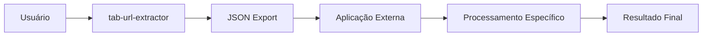

# Visão do Projeto: tab-url-extractor

## 🎯 Declaração de Visão

**tab-url-extractor** é uma extensão Chrome especializada que serve como **componente técnico de extração de dados** em ecossistemas de software maiores. Sua missão é coletar, processar e exportar URLs de forma neutra, estruturada e programática, atuando como uma **fonte de dados confiável** para aplicações que necessitam de URLs organizadas.

## 🧭 Filosofia do Projeto

### Princípio Central: Extrator Neutro

Este projeto não toma decisões sobre o "significado" das URLs. Ele não sabe o que é um vídeo, uma página de documentação ou um artigo de blog. Ele simplesmente:

1. **Coleta** URLs do navegador
2. **Normaliza** tecnicamente (padronização de formato)
3. **Deduplica** (remoção de duplicatas exatas)
4. **Agrupa** por critérios técnicos (domínio, prefixo)
5. **Exporta** em formato estruturado

A **inteligência e categorização semântica** são responsabilidade de aplicações consumidoras.

### Analogia Conceitual

```
tab-url-extractor é para URLs o que um ORM é para bancos de dados:
uma camada de abstração técnica que coleta e estrutura dados,
sem impor lógica de negócio específica.
```

## 🎨 Inspiração e Motivação

### Problema Original

Aplicações externas (como organizadores de conteúdo, sistemas de bookmarking, ferramentas de análise) frequentemente precisam de URLs do navegador do usuário. As soluções atuais são:

- **Gerenciadores de abas complexos**: Sobrecarga de funcionalidades desnecessárias
- **Scripts manuais**: Não são user-friendly, requerem conhecimento técnico
- **Extensões específicas**: Acopladas a plataformas (YouTube, GitHub, etc.)

### Solução Proposta

Uma extensão **minimalista e técnica** que faz uma coisa muito bem:

> "Extrair URLs de abas abertas e exportá-las em formato consumível por máquinas"

## 🚀 Objetivos Principais

### 1. Ser uma Fonte de Dados Confiável

- Formato de exportação **versionado e estável**
- Metadados completos e rastreáveis
- Garantia de integridade dos dados (normalização consistente)

### 2. Integração Programática

- JSON como formato principal (machine-readable)
- Schema bem definido e documentado
- Preparado para consumo por APIs, scripts, aplicações desktop

### 3. Arquitetura Extensível

- Core agnóstico ao navegador (reaproveitável)
- Separação clara de responsabilidades
- Preparado para evolução (novas fontes, formatos, critérios)

### 4. Simplicidade de Uso

- Interface minimalista (1 botão para analisar, botões para exportar)
- Zero configuração inicial
- Feedback visual claro

### 5. Conformidade com Manifest V3

- Service Worker ao invés de background pages
- Mensagens assíncronas
- Permissões mínimas necessárias

## 🎭 Personas e Casos de Uso

### Persona 1: Desenvolvedor de Aplicações

**Nome**: João, desenvolvedor full-stack

**Necessidade**: Precisa de URLs de vídeos do YouTube das abas do usuário para alimentar seu organizador de conteúdo.

**Uso**:
1. Instrui o usuário a instalar tab-url-extractor
2. Usuário exporta JSON via extensão
3. João consome o JSON em sua aplicação
4. Sua aplicação aplica lógica específica de YouTube

**Por que não uma extensão específica de YouTube?**
- João quer controlar a lógica de negócio
- Amanhã pode querer processar URLs de Vimeo, Udemy, etc.
- tab-url-extractor é neutro e serve para qualquer domínio

### Persona 2: Analista de Dados

**Nome**: Maria, analista de UX

**Necessidade**: Quer analisar padrões de navegação de usuários em testes de usabilidade.

**Uso**:
1. Pede ao usuário para exportar URLs após navegação
2. Importa JSON em sua ferramenta de análise
3. Gera insights sobre domínios mais visitados, padrões de navegação

### Persona 3: Power User Organizado

**Nome**: Pedro, pesquisador

**Necessidade**: Frequentemente acumula 50+ abas de artigos acadêmicos e precisa organizá-las por fonte.

**Uso**:
1. Exporta URLs agrupadas por domínio (URL-Matriz)
2. Revisa rapidamente quantas abas tem de cada fonte
3. Processa externamente ou fecha abas com confiança

## 🔬 Princípios de Design

### 1. Neutralidade Técnica

- Sem heurísticas de conteúdo
- Sem detecção de "tipo" de página
- Sem parsing de query parameters específicos

### 2. Previsibilidade

- Mesma entrada → Mesma saída
- Normalização determinística
- Deduplicação baseada em igualdade exata

### 3. Modularidade

- Cada módulo tem uma responsabilidade clara
- Interfaces bem definidas entre módulos
- Core isolado e testável

### 4. Extensibilidade Planejada

Arquitetura preparada para:
- Novas fontes de URLs (content scripts, bookmarks, histórico)
- Novos formatos de exportação (CSV, XML, YAML)
- Novos critérios de agrupamento (TLD, regex, path-based)

### 5. Documentação como Código

- Toda decisão arquitetural documentada
- Diagramas de fluxo e responsabilidades
- Exemplos práticos em todos os guias

## 🎓 Aprendizados e Princípios Arquiteturais

### Evitar Feature Creep

**Tentações a Resistir**:
- ❌ Adicionar detecção de duplicatas semânticas
- ❌ Implementar categorização automática de conteúdo
- ❌ Criar UI complexa com filtros e ordenação
- ❌ Adicionar sincronização com cloud
- ❌ Implementar lógica específica de plataformas

**Por que resistir?**
- Mantém o projeto focado e manutenível
- Permite que aplicações externas façam o que fazem melhor
- Reduz superfície de bugs e complexidade

### Clean Architecture na Prática

```
Dependências sempre apontam para dentro:
UI → Service Worker → Core Logic
Browser Infrastructure → Core Logic

Core Logic nunca depende de UI ou Browser APIs
```

### Versionamento Semântico de Dados

Formato de exportação segue versionamento:
- `1.0.0` - Formato inicial
- `1.1.0` - Novos campos opcionais (backward compatible)
- `2.0.0` - Mudanças breaking (schema incompatível)

## 🌍 Visão de Longo Prazo

### Fase 1: MVP Funcional (Atual)
- Coleta de abas
- Normalização básica
- Agrupamento por domínio
- Exportação JSON

### Fase 2: Expansão de Fontes (Futuro)
- Content scripts para URLs em páginas
- Bookmarks
- Histórico de navegação

### Fase 3: Formatos Avançados (Futuro)
- CSV com headers customizáveis
- XML para integração enterprise
- YAML para configuração

### Fase 4: Critérios Inteligentes (Futuro)
- Agrupamento por TLD (.com, .org, .edu)
- Agrupamento por path pattern
- Filtros via regex

### Fase 5: Ecossistema (Futuro)
- API pública para outras extensões
- Integração com serviços externos via webhooks
- Plugins para estender funcionalidade

## 💡 O Que Este Projeto NÃO É

Para manter foco, é importante declarar o que **não** faremos:

### 1. Não é um Gerenciador de Abas
- Não fecha, não agrupa visualmente, não salva sessões
- Usuário deve usar extensões especializadas para isso

### 2. Não é um Sistema de Categorização
- Não identifica "vídeos", "artigos", "documentação"
- Aplicações externas fazem isso melhor

### 3. Não é Específico de Plataforma
- Sem código especial para YouTube, Netflix, GitHub
- Tratamento uniforme de todas as URLs

### 4. Não é um Analisador de Conteúdo
- Não faz scraping de DOM
- Não extrai títulos, descrições, metadados de página

### 5. Não é um Sistema de Sincronização
- Não salva estado entre sessões
- Não sincroniza entre dispositivos

## 🧩 Integração com Ecossistema

### Exemplo: youtube-organizer (Aplicação Consumidora)

```
tab-url-extractor → Exporta JSON com URLs
                 ↓
    youtube-organizer ← Consome JSON
                 ↓
    - Filtra apenas youtube.com
    - Extrai video IDs
    - Consulta YouTube API
    - Categoriza por canal, playlist
    - Detecta duplicatas semânticas
    - Salva em banco de dados
```

### Fluxo de Integração



## 📜 Manifesto do Projeto

**Este projeto acredita que**:

1. **Separação de responsabilidades** é melhor que ferramentas monolíticas
2. **Dados estruturados** são mais valiosos que UIs sofisticadas
3. **Extensibilidade planejada** supera recursos imediatos
4. **Neutralidade técnica** permite mais casos de uso que especialização
5. **Documentação robusta** é tão importante quanto código funcional

---

**tab-url-extractor: Extraindo dados, não opiniões.**
